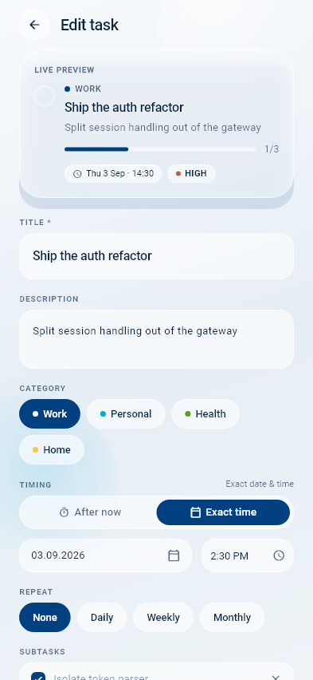
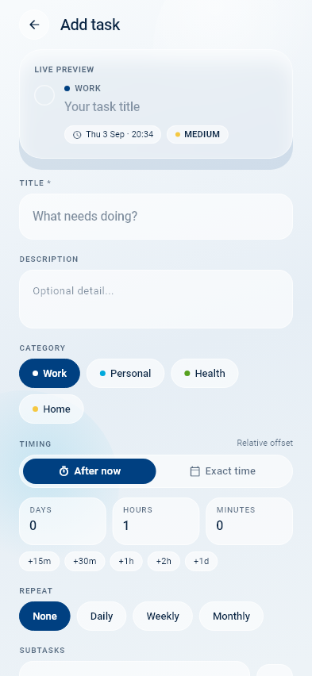
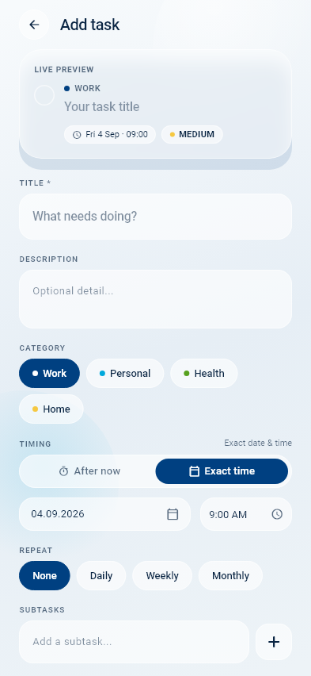
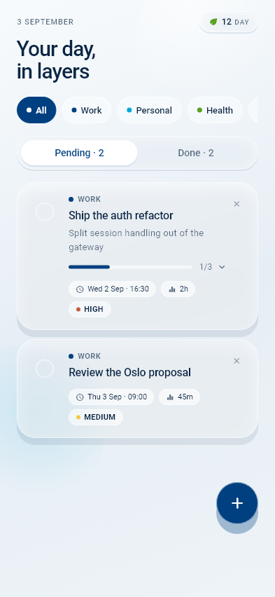

# Visual Showcase: Notifications, Edit Task & Timing Modes

This document showcases high-resolution UI captures of the newly implemented features:
1. **Android Sticky Notification** with the **"Mark Completed"** action button.
2. **Edit Task Screen** pre-populated with task data and subtasks.
3. **Timing Option 1: Relative Offset ("After now")** with Days, Hours, Minutes, and quick presets.
4. **Timing Option 2: Exact Date & Time** with calendar and time pickers (duration completely removed).
5. **Home Screen Pending Tasks** with tap-to-edit interactions.

---

## 1. High-Priority Sticky Notification with Action Button

The high-priority alert appears in the Android notification shade with persistent stickiness (`FLAG_NO_CLEAR` | `FLAG_ONGOING_EVENT`, `ongoing: true`, `autoCancel: false`) on channel `doto_high_priority_sticky_v2`. The **"Mark Completed"** action button directly invokes `ActionBroadcastReceiver` and updates the database without dropping broadcasts or launching unnecessary full-screen overlays.

---

## 2. Edit Task Screen (Pre-populated from Pending Tab)

Clicking any pending task card on the Home Screen opens the **Edit task** menu pre-populated with:
- Task title and description
- Category selection
- Priority and recurrence
- Cloned subtasks preserving existing UUIDs and completion checkmarks
- Primary button updated to **"Save changes"**

---

## 3. Timing Modes: Option 1 (Relative "After now")

The old DURATION section has been removed. The new **TIMING** control offers a 2-mode segmented toggle. In **Option 1 ("After now")**:
- **DAYS**, **HOURS**, and **MINUTES** inputs accept numeric offsets.
- Quick preset pills (`+15m`, `+30m`, `+1h`, `+2h`, `+1d`) rapidly configure timing with a single tap.
- Dynamic Live Preview calculates and formats the scheduled date & time in real time.

---

## 4. Timing Modes: Option 2 (Exact Date & Time)

Switching the toggle to **Option 2 ("Exact time")**:
- Displays the calendar date picker and time picker.
- Duration selection chips are absent, keeping the layout focused and streamlined.

---

## 5. Home Screen: Tap-to-Edit Pending Tasks

On the Home Screen:
- Tapping the task title, description, or chip area on any pending task card opens the **Edit task** menu.
- Checkboxes, subtask expansion bars, and delete buttons maintain independent gesture isolation.
- Completed tasks cannot be opened in edit mode.

